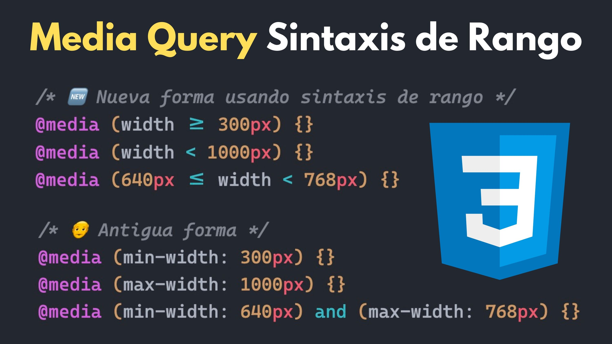

# Estos son algunos apuntes que considero importantes de mi día a día aprendiendo sobre desarrollo Web.

---

---

## Apuntes Básicos.

1. ¿Como eliminar el <b>.git</b> (luego de haber ejecutado el comando git.init) de una carpeta o proyecto?
   - En la carpeta de nuestro proyecto ejecutamos el comando
     `rm -rf .git`
2. [Como hacer un pull request](https://docs.github.com/es/pull-requests/collaborating-with-pull-requests/proposing-changes-to-your-work-with-pull-requests/creating-a-pull-request "Pull Rquest")

3. [Guía Markdown](https://tutorialmarkdown.com/guia "Guía Markdown")

4. ¿Cómo crear alias en git?
   - Creamos un alias para recortar nuestro comando de git push
     - <b>git config --global alias.pushall 'push -u origin main'</b>
     - De ahora en adelante podremos reemplazar toda la línea de comandos entre comillas simples por <b>git pushall</b>
     - Si queremos ver los alias que hempos creado ejecutamos lo siguiente
     - <b>git config --global --get-regexp alias</b>
5. La nueva forma de declarar media queries.
   .

6. El mejor curso práctico de Flexbox está en el siguiente enlace.
   [Flexbox](https://www.youtube.com/playlist?list=PLiyWNoCa29IIB_LuV8JUDVF9OpuVNT04l "Cursos en youtube")
